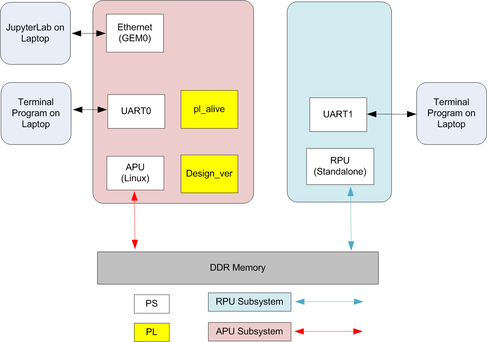
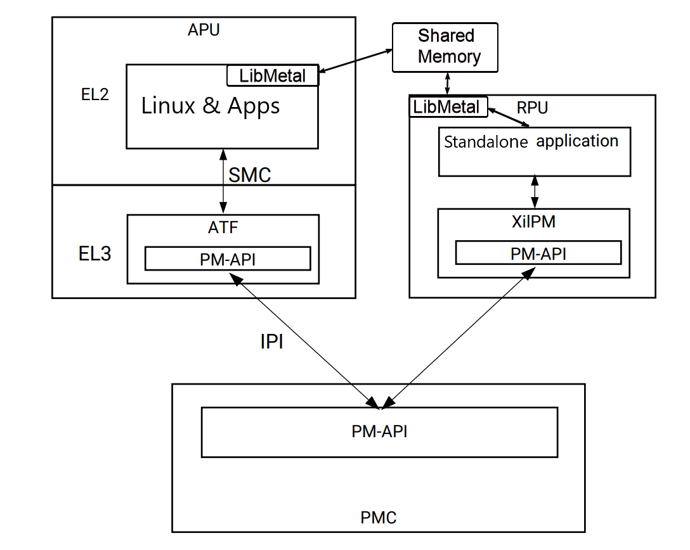

.. _intro:

Introduction
============

The Versal System and Subsystem Restart TRD (**VSSR TRD**), also referred to as
**Versal Restart TRD**, demonstrates how to restart various components of a system.
It also showcases the liveliness of a subsystem while another subsystem is undergoing
restart.

The TRD consists of a baseline Vivado design, Petalinux, Jupyter notebooks and other
software components to demonstrate different restart scenarios.

Features:
*********

* Subsystem definitions

  * APU subsystem running Linux

  * RPU Lockstep running a PM-aware standalone application

* Jupyter lab based user interface, with dashboard layout

* Libmetal shared-memory communication channel between APU and RPU subsystem

* Healthy boot monitoring for the subsystems

* Watchdog monitoring for the subsystems after boot

* Demonstration of following restart scenarios:

  * Subsystem Restart for Linux system running on APU

  * Subsystem Restart for Standalone system running on RPU

  * System Restart by APU

  * System Restart by RPU

  * System recovery due to boot hang during Linux boot

  * System recovery due to bad boot during Standalone RPU boot

  * Subsystem recovery due to Linux hang (by forcing FPD watchdog expiry)

  * Subsystem recovery due to RPU hang (by forcing LPD watchdog expiry)

  * APU Subsystem Restart from RPU application using image store feature

* Supports multiple platforms:

  * `VCK190 Evaluation boards <https://www.xilinx.com/products/boards-and-kits/vck190.html>`_

  * `VMK180 Evaluation boards <https://www.xilinx.com/products/boards-and-kits/vmk180.html>`_

Hardware Design
***************

The base design is a simple example of an APU subsystem with a register-based PL
design to allow the user to check if a PL subsystem was re-programmed or reset
without the user actively issuing a reset.  In the pl_alive module, there is register that uses the
Power On Reset (POR) mechanism of the Versal device to set a register to a high
value on initial power up.  This register is reset to a low value by the APU writing to a
register and should stay low as long as the PL is operational.  There is also a pulse
input to the module that acts as a heartbeat to the PL indicating that the APU is also
alive.  The pl_alive module takes this pulse signal and toggles an output port on the module which
can be read by the APU to see that the PL is responding to the pulse signal. There is also an
AXI GPIO module that has a fixed unique value for the software to read, which is used to detect
the design version in the PL.

Subsystem Definition
********************

The subsystem definition is important for the PLM to:

* Identify a subsystem by its ID

* Track the access permission of various peripheral for the subsystem

* Make sure the pre-alloced peripherals are available when the subsystem is loaded.

* Enable healthy boot monitoring for the subsystem.

The TRD defines two subsystems, **APU Subsystem** running Linux on SMP Cortex A72 cores and **RPU Subsystem**
running standalone application on Lock-Step Cortex R5 cores.

Following tables describe examples of some peripheral/device permission for APU and RPU subsystems, respectively, in this TRD:

+----------------------------------------------------------------------+
| APU Subsystem Management                                             |
+-----------------+-------------------------+--------------------------+
| Device          | Requested (Pre-alloced) | Subsystem Flags          |
+=================+=========================+==========================+
| Swdt_fpd        | No*                     | Time-shared              |
+-----------------+-------------------------+--------------------------+
| HB_MON_0        | Yes                     | Non-shared               |
+-----------------+-------------------------+--------------------------+

+----------------------------------------------------------------------+
| APU Subsystem Peripheral                                             |
+-----------------+-------------------------+--------------------------+
| Device          | Requested (Pre-alloced) | Subsystem Flags          |
+=================+=========================+==========================+
| DDR_0           | No                      | Time-shared              |
+-----------------+-------------------------+--------------------------+
| Uart_0          | No                      | None                     |
+-----------------+-------------------------+--------------------------+
| Uart_1          | No                      | Time-shared              |
+-----------------+-------------------------+--------------------------+
| I2C0            | No                      | None                     |
+-----------------+-------------------------+--------------------------+
| I2C1            | No                      | None                     |
+-----------------+-------------------------+--------------------------+
| SPI0            | No                      | Non-shared               |
+-----------------+-------------------------+--------------------------+
| SPI1            | No                      | Non-shared               |
+-----------------+-------------------------+--------------------------+
| OSPI            | No                      | Non-shared               |
+-----------------+-------------------------+--------------------------+
| QSPI            | Yes                     | None                     |
+-----------------+-------------------------+--------------------------+
| SD_eMMC0        | Yes                     | None                     |
+-----------------+-------------------------+--------------------------+
| SD_eMMC1        | Yes                     | None                     |
+-----------------+-------------------------+--------------------------+
| Gem_0           | Yes                     | Non-shared               |
+-----------------+-------------------------+--------------------------+
| Gem_1           | Yes                     | Non-shared               |
+-----------------+-------------------------+--------------------------+

+----------------------------------------------------------------------+
| RPU Subsystem Management                                             |
+-----------------+-------------------------+--------------------------+
| Device          | Requested (Pre-alloced) | Subsystem Flags          |
+=================+=========================+==========================+
| Swdt_lpd        | No                      | Time-shared              |
+-----------------+-------------------------+--------------------------+
| PMC_RTC         | No                      | None                     |
+-----------------+-------------------------+--------------------------+
| HB_MON_1        | Yes                     | Non-shared               |
+-----------------+-------------------------+--------------------------+

+----------------------------------------------------------------------+
| RPU Subsystem Peripheral                                             |
+-----------------+-------------------------+--------------------------+
| Device          | Requested (Pre-alloced) | Subsystem Flags          |
+=================+=========================+==========================+
| Uart_0          | No                      | None                     |
+-----------------+-------------------------+--------------------------+
| Uart_1          | Yes                     | Time-shared              |
+-----------------+-------------------------+--------------------------+
| I2C0            | No                      | None                     |
+-----------------+-------------------------+--------------------------+
| I2C1            | No                      | None                     |
+-----------------+-------------------------+--------------------------+
| QSPI            | No                      | None                     |
+-----------------+-------------------------+--------------------------+
| SD_eMMC0        | No                      | None                     |
+-----------------+-------------------------+--------------------------+
| SD_eMMC1        | No                      | None                     |
+-----------------+-------------------------+--------------------------+

Detail subsystem definition is available in the sources under *hw/common/subsystem.cdo* file.

.. note:: * *No* in Requested (Pre-alloced) column means the devices do not require to be pre-allocated. They can still be requested/accessed after booting.

          * Uart_0 is set to have *None* flag as it is being shared with plm for initial boot messages.

          * Access permission of Subsysten flags would be enforced both by hardware (using protection units) and software (using plm and pm permissions).

          * The location and size of image store is also included.

The detailed setting of each subsystem can be configured through isoutil, whose GUI inteface is as follows. For VCK190 and VMK180 platforms, the top flag settings (debugger_access, enable_protection, and write_subsystems) are all enabled as default.

.. figure:: images/intro/setting_and_messages.png

Software Stack
**************
This section list the software pieces involved in demonstrating the TRD features.

+----------------------+---------------+------------------------------------------------------------------+
|  Software            |  Processor    | Function with respect to TRD use cases                           |
+======================+===============+==================================================================+
|  PLM                 |  PMC          | Controls various restarts and maintains the life cycle of the    |
|                      |               | subsystem.                                                       |
+----------------------+---------------+------------------------------------------------------------------+
|  ATF                 |  APU          | Arm Trusted firmware (Running on ARM EL3) interacts directly with|
|                      |               | PLM (through IPI) for various PM activities, including restarts. |
|                      |               | Like all PM related requests, Linux's system and subsystem       |
|                      |               | restart requests are eventually handled by ATF.                  |
+----------------------+---------------+------------------------------------------------------------------+
|  XilPm Client lib    |  RPU LS       | This is the client side API library to issue PM requests to PLM. |
|                      |               | RPU application issues various PM requests, including restarts   |
|                      |               | through this library to the PLM.                                 |
+----------------------+---------------+------------------------------------------------------------------+
|  Linux               |  APU          | Hosts Jupyter Notebook server to demonstrate TRD features.       |
|                      |               | It also manages various APU peripherals, including FPD WDT       |
|                      |               | through the respective drivers. Linux Runs on ARM EL2.           |
+----------------------+---------------+------------------------------------------------------------------+
|  Standalone App      |  RPU LS       | PM aware application with standalone OS. It uses standalone      |
|                      |               | drivers to control various peripherals, like UART and LPD WDT.   |
|                      |               | It also establish and uses libmetal shared memory based          |
|                      |               | communication channel with APU.                                  |
+----------------------+---------------+------------------------------------------------------------------+

.. note:: There are other software pieces in the stack, like u-boot, psm-firmware, etc. but are not mentioned
          above as they don't actively participates in TRD demonstration.

Below diagram shows relationship and interaction between above pieces:

Please refer `Versal ACAP System Software Developers Guide <https://docs.xilinx.com/r/en-US/ug1304-versal-acap-ssdg>`_ for more details on software stack and detailed development guide for each component.

Refer to **Restart Use Cases** section in the :ref:`Appendix` for details on each of the TRD use cases and the software components involved.

Package
*******

The reference design package contains of 2 parts:

* Binaries

  * Pre-built binaries

  * Available in `zip file`_ for each board variant

* Sources

  * Sources and build scripts to build hardware, software and documentation.

  * Available in the `git repository <https://github.com/Xilinx/versal-restart-trd>`_.

Binaries
--------

Download the `zip file`_ from Xilinx.com, for the specific board variant.

It has the following contents:

* Pre-built SD card image

* Artifacts from hardware and software builds under *reference_images/*

* README file

The zip contents for **vck190-prod** are as follow ::

 vssr-trd-pb-vck190-prod-2024.1.zip
 │
 vssr-trd-vck190-prod
 ├── LICENSE
 ├── prebuilt
 │   ├── petalinux-sdimage.wic.xz
 │   └── reference_images/
 │       ├── bl31.elf
 │       ├── boot.bif
 │       ├── BOOT.BIN
 │       ├── boot.scr
 │       ├── Image
 │       ├── plm.elf
 │       ├── psmfw.elf
 │       ├── ramdisk.cpio.gz.u-boot
 │       ├── rootfs.tar.gz
 │       ├── rpu_app.elf
 │       ├── system.dtb
 │       ├── u-boot.elf
 │       ├── versal_restart_trd_wrapper.pdi
 │       └── versal_restart_trd_wrapper.xsa
 └── README

Same file structure is available for other variants (vmk180-prod) as well.

Sources
-------

Sources for the TRD are available in the git repository.
It provides:

* Sources for the hardware design

* Sources for the TRD yocto layer (used in Petalinux)

* Sources for the standalone rpu application

* Sources for the documentation

* Makefiles and Scripts to build all the sources

Clone the git repository for the current release tag.
::

  # Create and move to directory where the source repository is to be cloned
  mkdir -p </path/to/source/repo>
  cd </path/to/source/repo>

  # clone and switch to current release tag (amd/xilinx-v2024.1)
  git clone https://github.com/Xilinx/versal-restart-trd.git
  cd versal-restart-trd
  git checkout amd/xilinx-v2024.1

From the cloned area, run :code:`make help` to see various build options.

The repository directory structure is as follow::

 versal-restart-trd
 ├── docs
 │   ├── ... document sources
 │   └── Makefile           # Documentation Makefile
 ├── hw
 │   ├── common             # Common constraints and subsystem definition
 │   ├── ip_repo
 │   ├── Makefile           # Hardware Makefile
 │   ├── vck190_prod_base   # sources for each variants
 │   └── vmk180_prod_base
 ├── LICENSE
 ├── Makefile               # Top level Makefile
 ├── README.md
 └── sw
     ├── Makefile           # Software Makefile
     ├── scripts            # Script to configure or build
     ├── standalone-srcs    # Rpu application sources
     └── yocto-layers       # Yocto layers to be included in TRD

Licenses
********

The design includes files licensed by Xilinx and third parties under the terms
of the GNU General Public License, GNU Lesser General Public License,
BSD License, MIT License, and other licenses.

Licenses for rootfs files are included in the /usr/share/licenses directory when
the image file is built. DNF package manager can be used to list all packages in the
image as well as download all the sources for all the packages.

LICENSE file included the prebuilt image's `zip file`_ details the licenses of the packages
used in the prebuilt images.

You are solely responsible for checking any files you
use for notices and licenses and for complying with any terms applicable to your
use of the design sl-restart-trdss any third party files supplied with the design.

.. _`zip file`: https://github.com/Xilinx/versal-restart-trd/blob/xilinx-v2024.1/README.md#prebuilt-images

