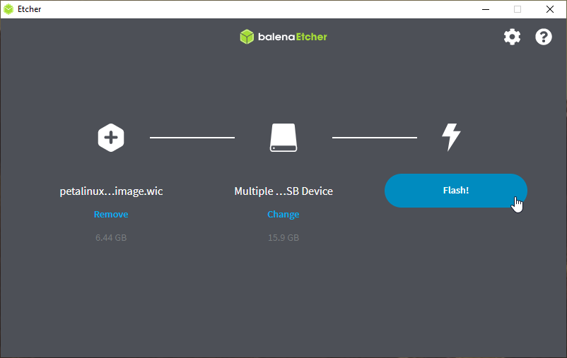
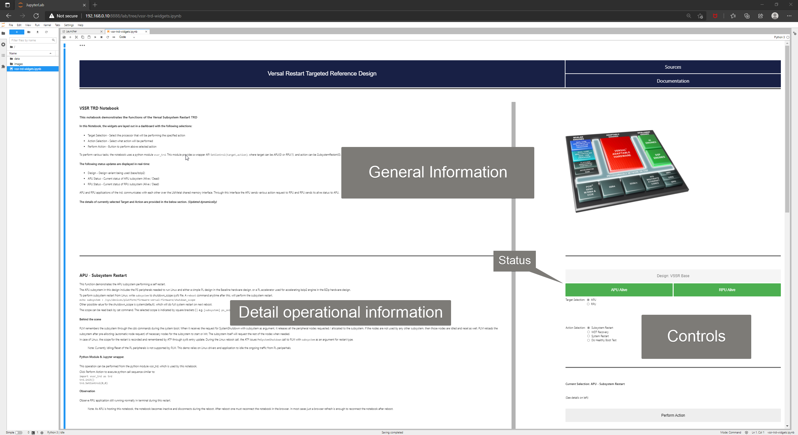

.. _run:

Run Images on Target
====================

.. _Prerequisites:

Prerequisites
-------------

* SD card image.

  * Download `Prebuilt Images <https://github.com/Xilinx/versal-restart-trd/blob/xilinx-v2021.2/README.md#prebuilt-images>`_ and use the prebuilt petalinux-sdimage.wic.xz

  * Alternatively build the petalinux-sdimage.wic.xz from the build tutorial.

* Image flashing tool, for example:

+-----------+------------------+-------------------------------------------------+
|    OS     |    Program       |    Link                                         |
+===========+==================+=================================================+
| Windows   |  Balena Etcher   | https://www.balena.io/etcher/                   |
+-----------+                  |                                                 |
| Linux     |                  |                                                 |
+-----------+------------------+-------------------------------------------------+

* Terminal emulator, for example:

+-----------+------------------+-------------------------------------------------+
|    OS     |    Program       |    Link                                         |
+===========+==================+=================================================+
| Windows   |  teraterm        | https://osdn.net/projects/ttssh2                |
+-----------+------------------+-------------------------------------------------+
| Linux     |  picocom         | https://github.com/npat-efault/picocom/releases |
+-----------+------------------+-------------------------------------------------+

* Chrome or Firebox browser:

+-------------------+------------------+------------------------------------------+
|    OS             |    Program       |    Link                                  |
+===================+==================+==========================================+
| Windows / Linux   |  Chrome          | https://www.google.com/chrome/           |
+-------------------+------------------+------------------------------------------+
| Windows / Linux   |  Firefox         | https://www.mozilla.org                  |
+-------------------+------------------+------------------------------------------+

SD Card Creation
----------------

* Plug uSD card (minimum 8 GB of size) in the host machine.

* Flash petalinux-sdimage.wic.xz (locally built or downloaded prebuilt) in to the uSD card.

  * Install and launch Balena Etcher (or any image writing tool) and follow the wizard.

    * Browse and select the petalinux-sdimage.wic.xz image as file to be flashed.
      (Balena Etcher will uncompress the .xz file automatically. Uncompress manually, if other tool is used)

    * Select target as uSD card

    * Click flash to write the image.

Board Setup
-----------

The following figure shows how to set up the VCK190 or VMK180 evaluation boards.

.. figure:: images/run/vck190-setup-no-router.jpg
  :width: 50%
  :align: center
  :alt: VCK190 Board Setup

**Board jumper and switch settings**

This is a onetime setup and the board should have been delivered to you with
this default settings, but it is good to double check for the first time when
you get the board.

* Make sure you remove J326 (7-8) jumper.

* Setup SYSCTRL Boot mode switch SW11 to (ON,OFF,OFF,OFF) from switch bits
  1 to 4 as shown in the above picture.

* The Evaluation kit comes with an image pre-installed on the System Controller micro SD card. If for some reason the System Controller uSD card is corrupted or damaged, you can create new by flashing the prebuilt `System Controller SD Image <https://www.xilinx.com/member/forms/download/xef.html?filename=intermediate_petalinux-sdimage.zip>`_.

* Setup Versal Boot Mode switch SW1 to (ON,OFF,OFF,OFF) from switch bits 1 to 4
  as shown in the above picture.

**Serial console settings**

The Evaluation Boards come with a USB-C connector for JTAG+UART, and when connected three UART
ports should be visible in Device Manager.  They will not be identified by name,
but they will correspond to the following:

* Versal UART0

* Versal UART1

* System Controller UART

Connect a USB-C cable to the USB-UART connector. Since the COM ports are not identified
by name, open three terminal emulators, and choose one COM port for each one using
the following settings:

* Baud Rate: 115200

* Data: 8 bit

* Parity: None

* Stop: 1 bit

* Flow Control: None

UART0 will be used for PLM, U-boot, and Linux on APU. UART1 will be used for RPU prints.
System Controller UART will not be used, and can be closed once its terminal has been
identified.

**Ethernet IP settings**

The JupyterLab Server IP address is fixed (static) at ``192.168.0.10``.

In order for this server to be seen by another computer, such as a laptop, the computer
needs to be on the same subnet.

On Linux, type::

        ifconfig

Note the Ethernet adapter name given, then type::

        ifconfig <adapter> 192.168.0.xxx

where ``.xxx`` can be anything other than ``.10`` which would conflict with the JupyterLab server.

.. figure:: images/run/ifconfig_linux.png
  :width: 50%
  :align: center
  :alt: ifconfig_linux

On Windows, set the IP address from Control Panel as shown below.

.. figure:: images/run/set_ip_windows.png
  :width: 50%
  :align: center
  :alt: set_ip_windows

Connect to the JupyterLab Server
--------------------------------

Follow these steps to boot the board into Linux.

* Ensure all steps under the section 'Board jumper and switch settings' are
  verified.

* Insert the prepared micro SD card into the Versal SD card slot (refer to
  `Board Setup`_)

* Make physical connections to ethernet, UART, and power as shown
  in the image.

* Have the UART0 & UART1 terminal emulator connected.

* Turn ON power switch SW13.

* On Versal UART0 terminal, Versal device boot messages should appear starting with the message
  "Xilinx Versal Platform Loader and Manager"

* In about 60 seconds boot is complete. Observe the Linux prompt
  *root@plnx-<board>-<sil>* and autostart of JupyterLab server as shown
  in the example below::

    root@plnx-vmk180-es1:~# [I 2038-02-17 10:13:21.707 ServerApp] jupyterlab | extension was successfully linked.
    [I 2038-02-17 10:13:21.879 LabApp] JupyterLab extension loaded from /usr/lib/python3.8/site-packages/jupyterlab
    [I 2038-02-17 10:13:21.879 LabApp] JupyterLab application directory is /usr/share/jupyter/lab
    [I 2038-02-17 10:13:21.896 ServerApp] jupyterlab | extension was successfully loaded.
    [I 2038-02-17 10:13:21.896 ServerApp] Serving notebooks from local directory: /usr/share/notebooks/vssr-trd
    [I 2038-02-17 10:13:21.897 ServerApp] Jupyter Server 1.2.1 is running at:
    [I 2038-02-17 10:13:21.897 ServerApp] http://192.168.0.10:8888/lab
    [I 2038-02-17 10:13:21.897 ServerApp]  or http://127.0.0.1:8888/lab
    [I 2038-02-17 10:13:21.897 ServerApp] Use Control-C to stop this server and shut down all kernels (twice to skip confirmation).

Follow these steps to connect to the jupyter-server using Chrome browser on the
laptop.

**Note:** This demo is tested with Chrome browser, but Firefox should work as well.

* Type the IP address of the Jupyter server in the browser address bar of the laptop::

    http://192.168.0.10:8888

  .. figure:: images/run/password.png
    :width: 50%
    :align: center
    :alt: Jupyter Login

* Enter the password ``vssr-trd``

* Click *Log in* button

  **Note:** To stop and restart the Jupyter server, use the following commands::

    /etc/init.d/jupyterlab-server stop
    /etc/init.d/jupyterlab-server start

* To look up the jupyter server IP address on the target, run::

    jupyter lab list

Run the TRD Notebook
--------------------

This TRD includes a Jupyter notebook to demonstrate various restart options.

Start the Notebook
******************

#. On the left pane (File browser pane)  of the browser, double-click vssr-trd-widgets.ipynb to open the notebook.

#. Select menu **Run > Run All Cells**. This will start the TRD dashboard.

   .. figure:: images/run/jupyter-open.png
     :width: 50%
     :align: center
     :alt: jupyter-open

   .. figure:: images/run/jupyter-runall.png
     :width: 50%
     :align: center
     :alt: jupyter-runall

This will start the TRD dashboard in the notebook.

Using the Notebook
******************

The notebook is laid out in a dashboard which allows to choose various TRD operations.

* The top half of the notebook presents the general information about the notebook with
  links to documentation and sources.

  .. figure:: images/run/dashboard-top.png
    :width: 75%
    :align: center
    :alt: dashboard-top

* The bottom half of the notebook has 2 panes

  * **Control & Status pane on the right**: Which allows to perform various TRD actions and
    shows the live status of subsystem.

  * **Description pane on the left**: Shows detailed description of current selection in the control pane.
    This is updated dynamically when the selection in Control pane changes. The following information is displayed:

    * Introduction and how the agent will normally perform this operation.

    * Behind the scene operation done by PLM and other intermediate layers.

    * How this operation can be triggered using the python module

    * Observation and what to expect.

  .. figure:: images/run/rpu-ss.png
    :width: 75%
    :align: center
    :alt: rpu-ss

Control Selections
******************

Following TRD operations can be selected using the control pane.

+-----------+--------------------+-------------------------------------------------+
|  Target   |     Action         |    Description                                  |
+===========+====================+=================================================+
| APU       |  Subsystem Restart | APU performs self (subsystem only) restart      |
|           +--------------------+-------------------------------------------------+
|           |  Watchdog Recovery | APU kills FPD watchdog to demonstrate recovery  |
|           +--------------------+-------------------------------------------------+
|           |  System Restart    | APU performs full system restart                |
|           +--------------------+-------------------------------------------------+
|           |  Healthy Boot Test | APU demonstrate healthy boot based recovery     |
+-----------+--------------------+-------------------------------------------------+
| RPU       |  Subsystem Restart | RPU performs self (subsystem only) restart      |
|           +--------------------+-------------------------------------------------+
|           |  Watchdog Recovery | RPU kills LPD watchdog to demonstrate recovery  |
|           +--------------------+-------------------------------------------------+
|           |  System Restart    | RPU performs full system restart                |
|           +--------------------+-------------------------------------------------+
|           |  Healthy Boot Test | RPU demonstrate healthy boot based recovery     |
+-----------+--------------------+-------------------------------------------------+

After the selection **Perform Action** button triggers the selected action.

Refer to **Restart Use Cases** section in the :ref:`Appendix` for more details on each of the use cases.

Terminal based Testing
----------------------

All the use cases can be tested even without Jupyter Notebook, through the terminal.
A python script `vssr-test` provides menu based selection for variou use cases.

From the Uart0 terminal just type `vssr-test` to execute this python script.

  .. figure:: images/run/terminal-test.png
    :width: 50%
    :align: center
    :alt: terminal-test

Troubleshooting
---------------

#. If after restarting the APU subsystem, the Jupyter notebook does not reconnect, try hitting
   F5 key to refresh.

#. If the petalinux image is configured to have dynamic (static in tutorial), then enter the new
   ip address (if the board ip is reassigned) after each reboot in the browser.

#. If after restarting the APU subsystem, you are prompted for the key again, make sure that
   cookies are enabled in your browser.
