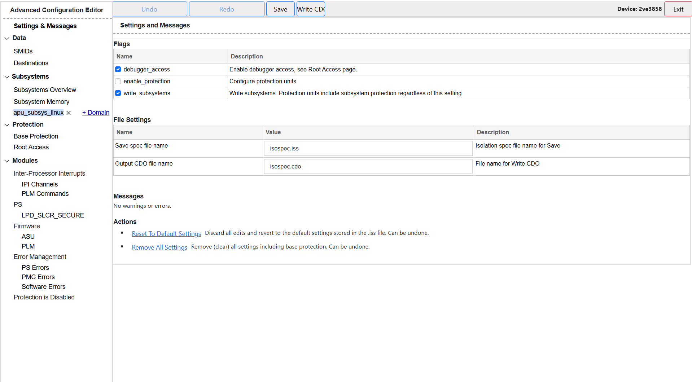

# Subsystem Restart TRD for Versal AI Edge Gen2 (vek385)

Copyright (C) 2019 - 2021 Xilinx, Inc. All rights reserved.<br>
Copyright (C) 2023 - 2025, Advanced Micro Devices, Inc. All rights reserved.<br>

SPDX-License-Identifier: MIT

# Table of Contents:
[](#introduction)<br>
[](#build-instructions-and-artifacts)<br>
[](#references)<br>

# Introduction
The vek385 device based on Versal AI Gen2 Architecture has 8 A78 Arm Cores and 10 R52 Arm Cores for APU and RPU respectively. Subsystem Restart TRD demonstrates how various components perform restarts with software level isolation using Subsystem Configuration. <br>
- This TRD consists of a Custom Subsystem 6 which isolates all the APU cores running linux.
- User gets a comprehensive command-line interface to interact with; which helps them perform Subsystem and System level restarts.
- This interface can run on both: Linux running on APU as well as the System Controllers.
- We recommend running the interface on System Controller to get the full experience of what this TRD aims at.

### VEK385 Board Overview
[VEK385 Evaluation Kit](https://www.amd.com/en/products/adaptive-socs-and-fpgas/evaluation-boards/vek385.html)<br>


### Running Command-Line Interface
```console
root@amd-edf:~# python /opt/subsys-restart-app/subsys-restart-cmd.py 
[INFO] Package running on System Controller


/----┬------------------------------┬---------------------------------------------------------------------------------------------------------\
| ID |         Name                 |                                         Description                                                     |
|----|------------------------------|---------------------------------------------------------------------------------------------------------|
| 1  |    APU Subsystem Restart     | APU performs a self-subsystem restart. APU talks to PLM to perform subsystem shutdown scope             |
| 2  |      APU System Restart      | APU performs a system restart. APU talks to PLM to perform system shutdown scope                        |
| 3  |   APU Healthy Boot Recovery  | APU fails to boot, triggering PLM to perform system wide restart as part of Healthy Boot Recovery       |
| 0  |         Exit                 |                                     Close TSSR TRD App!                                                 |
\----┻------------------------------┻---------------------------------------------------------------------------------------------------------/
Select an operation ID: 
```

<br>


# Build Instructions and Artifacts
### Software Scripts
```
.
.
.
.
│
└──versal_2ve_2vm
   └── vek385                                                 # vek385 board specific files
       ├── config.json                                        # vek385 configuration for the TRD application(s)
       ├── ace-project                                        # ACE (Advanced Configuration Editor) project
       │   ├── isospec.iss
       │   └── subsys-overlay.cdo                             # overlay cdo for subsystem level configurations
       └── recipes-bsp                                        # TRD specific recipes for EDF Yocto build
           └── bootbin
               ├── versal-2ve-2vm-apu-subsys.inc
               ├── versal-2ve-2vm-rpu-subsys.inc
               └── xilinx-bootbin_%.bbappend

```

### Subsystem Configuration
The detailed setting of each subsystem can be configured through ACE (Advanced Configuration Editor) tool, which is a GUI based tool. The following artifacts are used for subsystem configuration:
- `subsystem-restart-trd/versal_2ve_2vm/vek385/ace-project/isospec.iss` - ACE project specification file, which is an input to the tool. The provided `isospec.iss` file contains the necessary configuration for the TRD ( which if needed can be re-configured by the user )
- `subsystem-restart-trd/versal_2ve_2vm/vek385/ace-project/subsys-overlay.cdo` - Overlay CDO file for subsystem level configurations. The tool generated following cdo file which is needed during PDI generation to deploy subsystem level configurations

The TRD defines a single subsystem, **APU Subsystem** running Linux on SMP Cortex A78 cores<br>
Following tables describe examples of some peripheral/device permission for APU and RPU subsystems, respectively, in this TRD:

**Management Resources**

| Device | Requested (Pre-allocated) | Access Permission |
|--------|---------------------------|-------------------|
| Swdt_fpd | Yes | Concurrent-Shared |
| HB_MON_0 | Yes | Non-shared |
<br>

**Peripheral Devices**
| Device | Requested (Pre-allocated) | Access Permission |
|--------|---------------------------|-------------------|
| Uart_0 | Yes | Concurrent-Shared |
| Uart_1 | Yes | Concurrent-Shared |
| I2C0 | No | None |
| I2C1 | No | None |
| SPI0 | Yes | Concurrent-Shared |
| SPI1 | Yes | Concurrent-Shared |
| OSPI | Yes | Concurrent-Shared |
| QSPI | Yes | Concurrent-Shared |
| SD_eMMC | Yes | Concurrent-Shared |
| UFS | Yes | Concurrent-Shared |
| GEM_0 | Yes | Concurrent-Shared |
| GEM_1 | Yes | Concurrent-Shared |
| USB_0 | Yes | Concurrent-Shared |
| USB_1 | Yes | Concurrent-Shared |
| DMA[0-7] | Yes | Concurrent-Shared |
<br>

**ACE GUI Overview**


### EDF Artifacts
- EDF .wic image: https://www.xilinx.com/support/download/index.html/content/xilinx/en/downloadNav/embedded-design-tools.html
- EDF SGTGen Directory: https://edf.amd.com/sswreleases/rel-v2025.2/sdt/2025.2/2025.2_1115_1_11150857/external/versal-2ve-2vm-vek385-revb-sdt-seg/

### Installation Steps
- source vitis / vivado `settings64.sh` script

- run provided trd build script
```bash
cd edf-yocto-build
./trd-build.sh -sdt <provide-sdt-gen-directory-path> -brd vek385
```
OR
```bash
cd edf-yocto-build
./trd-build.sh -xsa <provide-xsa-file-path> -brd vek385
```

- Build rpm package
```bash
cd subsystem-restart-trd/rpmbuild
./build-package.sh
```

- Install the rpm package on both Versal2 and System Controller
```bash
rpm -ivh subsys-restart-app-2025.2-1.noarch.rpm
```

- Launch command-line interface either on Versal2 or System Controller (we recommend System Controller for better experience)
```bash
python3 /opt/subsys-restart-app/subsys-restart-cmd.py
```
# References
- [AMD Versal AI Edge Series Gen 2 Porfolio](https://www.amd.com/en/products/adaptive-socs-and-fpgas/versal/gen2/ai-edge-series.html)
- [AMD VEK385 Evaluation Kit](https://www.amd.com/en/products/adaptive-socs-and-fpgas/evaluation-boards/vek385.html)
- [Xilinx Wiki - Versal Evaluation Board](https://xilinx-wiki.atlassian.net/wiki/spaces/A/pages/2273738753/Versal+Evaluation+Board+-+System+Controller+-+Update+7)
- [Versal AI Edge Series Gen 2 Technical Reference Manual](https://docs.amd.com/r/en-US/am026-versal-ai-edge-prime-gen2-trm)
